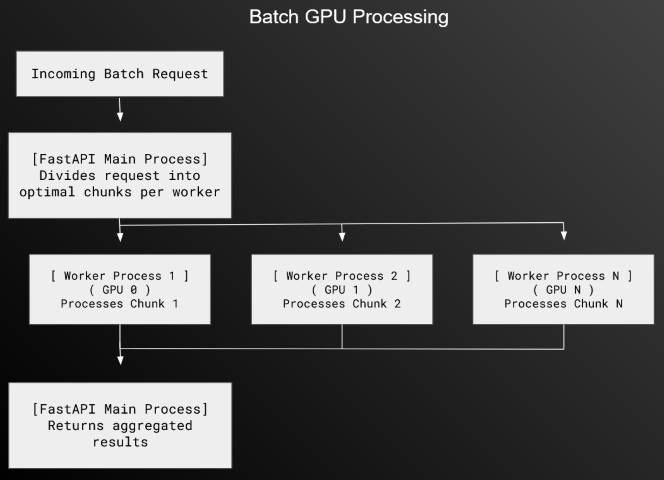

## ESM-2 FastAPI with Multi-GPU Inference
This repository provides a containerized FastAPI service
for calculating embeddings from ESM-2 protein language model.

Runs on single node and detects all available GPUs, spinning
up workers to handle batch GPU processing

#### Scaling

The application uses a master-worker architecture.
Workers are launched using `ProcessPoolExecutor` from `concurrent.futures`
When initialized, workers receive a gpu device id over a `torch.multiprocessing.Queue` so the GPU assignments remain isolated.

Each worker loads the same model replica and processes chunks distributed from the main FastAPI process
Chunks are calculated optimally using `math.ceil(total_seqs / self.num_workers)`

To maintain asynchronous execution of the main thread, chunks are dispatched with `asyncio.get_running_loop().run_in_executor()`
so that the web server stays active and responds to requests even when processing batches

After a specific task completes, results are gathered and returned with `asyncio.gather`

The application is designed to scale near-linearly with the addition of GPUs
